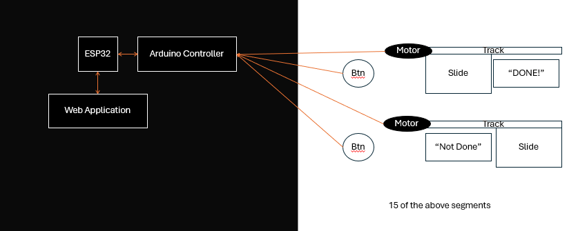

# To-Do Board CSC 494

## Project Description
This project is meant to produce a To-Do list that can be updated on the go via a web application, resets every night, and is physical and satisfying to use to motivate the completion of tasks.

## Problem Domain and Motivation
Currently, I live with my girlfriend and we struggle to keep track of if the animals have been fed. I also tend to procrastinate, and having a physical to-do list with actual buttons will make the process of completing a task more fun.

## Features and Requirements
1. The list will keep track of multiple To-Do tasks
2. The list will have physical buttons to select when a task has been finished
3. The list will connect to a web application that allows the user to update it on the go
4. The list will reset at a set time every day
    1. The time will be set on the web application, but also saved on the physical board in case of an internet issue
    2. The physical board's doors will slide back at the reset time
    3. The web application will be reset as well
5. The list will produce some sort of 'satisfying' event when the task is complete
    1. If done online, conffetti will appear on screen.
    2. If done on the physical list, a sliding door on the board will move from "not done" to "done"

## Basic Model
Physical Board Model:

## Test cases
1. Is the list able to track multiple To-Do tasks?
2. Do each of the physical buttons on the list result in the associated task being marked as completed in both the web application and physical board?
3. Does updating each list item using the web application also update the physical board?
4. Does the list reset at the set time?
    1. If the list loses connection, is it still able to reset using the previously saved time?
    2. Do the physical board's doors slide back at the set time each day?
    3. Does the web application reset at the set time?
5. Does the list feel satisfying to use? Do events take place that makes completing a task feel more fun to me on both the web application and physical board?

## Team members
Me :D

## Links
Code: [/src](src)

Tests: [/tests](tests)

Documentation: [/docs](docs)

Presentations: [/docs/Presentations](docs/Presentations)