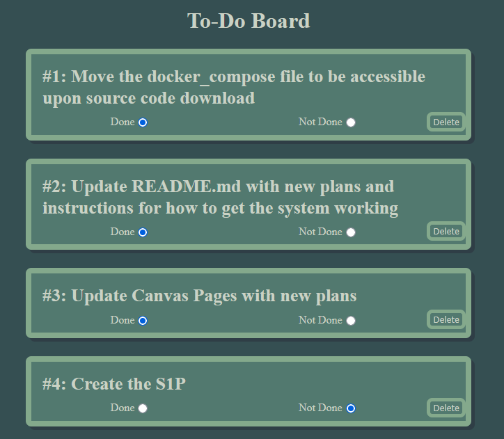
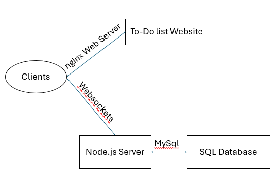

# To-Do Board CSC 494 - S1P
## Mitchell Playforth

---

## Problem Domain and Motivation (Slight Changes)
- I tend to procrastinate, so I want to have something that I can check off when I get something done. 
- Access this on multiple devices.
- Goal is to make a To-Do list that can be updated from any device and is satisfying to use to motivate the completion of tasks.

---

## Progress
- I have not started the hardware side.
- Software side is nearly done!
    - Able to create, delete, and mark tasks as done.
    - Able to connect from another device to my computer.

---

## Demonstration

---

## Server Design

---

## AI Usage
- Mostly using Google's AI overview for specific pieces of information I needed.
- Very helpful for properly setting up the Dockerfile and docker-compose files.

---

## Moving forward
- Make the setup more secure
    - Protect against xss attacks
- Make using the To-Do list more satisfying
    - I want to add a sliding bar to mark the item as done, and confetti to pop out after doing so.
- Create a stationary device I can set up at home that stays connected to the list so I can quickly access it.
    - Using a Raspberry PI, touchscreen, and 3D printed case with stand
    - Use AI to help with setting up the PI and touchscreen, and potentially with 3D printing.

---

## Thank you!
Any questions?